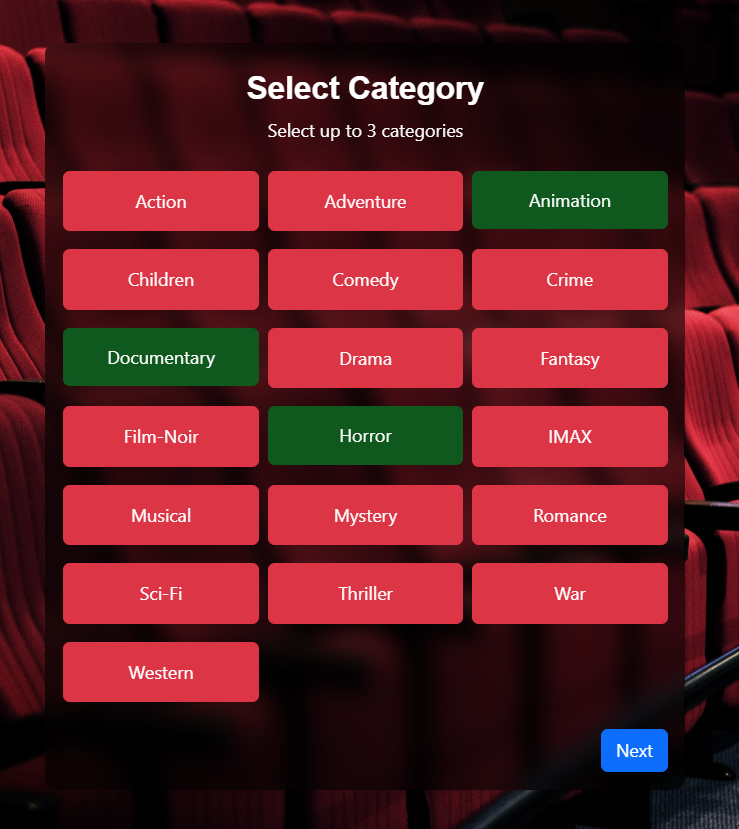
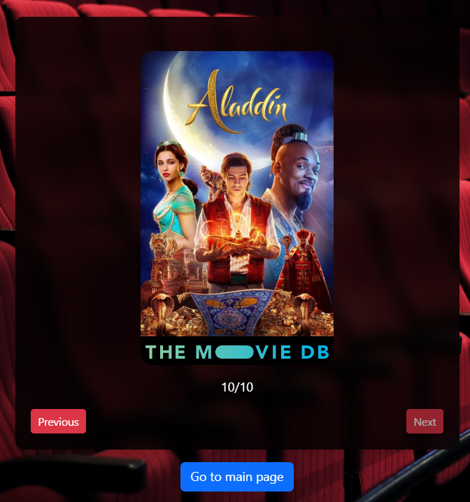

# Movie Predict

This project is a machine learning system that predicts movie ratings and makes recommendations based on users movie preferences. The model makes predictions using user, movie, and genre information, and is made available for use in the web environment with TensorFlow.js.

**This project was developed in collaboration with [Abdülbaki Demir](https://github.com/AbdulbakiDEMIR).**

## Project Structure

```
Movie Predict/
│
├── convert_to_tensorflowjs/
│   ├── convert_tensorflowjs.py
│   ├── model_export.py
│   ├── other_web_files/
│   │   ├── mlb_classes.js
│   │   ├── movie_encoder.js
│   │   └── movies.js
│   └── requirements.txt
│
├── train/
│   ├── train.py
│   └── requirements.txt
│
└── docs/
    ├── index.html, app.js, config.js
    ├── components/, js/, css/, img/
    └── model/ (Model files for web)
```
> ⚠️ **Python 3.10 was used throughout the project and is recommended for use.**


## Dataset Information

This project uses the [Movie Recommendation System dataset from Kaggle](https://www.kaggle.com/datasets/parasharmanas/movie-recommendation-system) as its primary data source. The dataset contains user ratings, movie information, and genres, which are used for training and evaluating the recommendation model.

- The dataset is automatically downloaded in the training phase using the Kaggle API.
- Please make sure you have a valid Kaggle API key to access and download the dataset.


## 1. Cloning the Project

```bash
git clone https://github.com/ahmet-yasir/Movie-Predict
cd Movie-Predict
```

---


## 2. Training (train/)

- **train.py**: Downloads movie and user data from Kaggle, processes the data, encodes user and movie IDs, vectorizes genres, and trains the deep learning model.
- **Outputs:**

  - `movie_predict_model.h5`: Trained Keras model.
  - `movie_encoder.pkl`, `mlb.pkl`: Movie and genre encoders (in pickle format).

### Training Flow

1. Data is downloaded from Kaggle.
2. Users and movies are encoded.
3. Genres are converted to multi-label vectors.
4. The model is trained and saved.
5. Encoders are saved as pickle files.

### 2.1 Environment Setup
It is recommended to set up a virtual environment for better compatibility of libraries.
```bash
cd train
```
**2.1.1 Creating a virtual environment on Windows**
```bash
python -m venv train_env
train_env\Scripts\activate
pip install -r requirements.txt
```
**2.1.2 Creating a virtual environment on macOS/Linux**
```bash
python -m venv train_env
source train_env/bin/activate
pip install -r requirements.txt
```
**2.1.3 Creating an environment with conda**
```bash
conda create --name train_env python=3.10
conda activate train_env
pip install -r requirements.txt
```
### 2.2 Starting Training
To start training, simply run the following command:
```bash
python train.py
```
This command will start the training process. When the training is complete, `movie_predict_model.h5`, `movie_encoder.pkl`, and `mlb.pkl` will be generated in the train directory. The `movie_predict_model.h5` file will later be used to convert the model to TensorFlowJS format.

---
## 3. Model Conversion (convert_to_tensorflowjs/)

- **convert_tensorflowjs.py**: Converts the trained Keras model to TensorFlow.js format.
- **model_export.py**: Exports the model and prepares the necessary files for the web.
- **final_model/**: Converted TensorFlow.js model files (`model.json`, `group1-shard*.bin`).
- **other_web_files/**: Helper JS files for the web application (encoder and class lists).

### 3.1 Environment Setup
It is recommended to set up a virtual environment for better compatibility of libraries.
```bash
cd ../convert_to_tensorflowjs
```
**3.1.1 Creating a virtual environment on Windows**
```bash
deactivate
python -m venv tfjs_env
tfjs_env\Scripts\activate
pip install -r requirements.txt --no-deps
```
**3.1.2 Creating a virtual environment on macOS/Linux**
```bash
deactivate
python -m venv tfjs_env
source tfjs_env/bin/activate
pip install -r requirements.txt --no-deps
```
**3.1.3 Creating an environment with conda**
```bash
conda deactivate
conda create --name tfjs_env python=3.10
conda activate tfjs_env
pip install -r requirements.txt --no-deps
```
### 3.2 Running the Programs

First, move the trained and saved `movie_predict_model.h5` model to the `/convert_to_tensorflowjs` directory.
Then, run the following command to execute model_export.py:
```bash
python model_export.py
```
This should create the `/saved_model_dir` directory as output.

After this step, there is one last step to convert the model to tensorflowjs format. Use the following command:

```bash
python convert_tensorflowjs.py
```

After this command, the `/final_model` directory should be created. With this file, you can use your model in the web interface with JavaScript.

If you encounter a *ModuleNotFoundError: No module named 'tensorflow_decision_forests'* error at this step, follow the next steps.

### 3.3 Solution for tensorflow_decision_forests Error
If you encounter the following error while running `convert_tensorflowjs.py`:

```
ModuleNotFoundError: No module named 'tensorflow_decision_forests'
```

The reason for this error is an unnecessary `import tensorflow_decision_forests` line in one of the files inside the `tensorflowjs` package.

### Solution

You need to locate the following file:

```
<your_python_env_path>/lib/site-packages/tensorflowjs/converters/tf_saved_model_conversion_v2.py
```

> **Note:** This file path may vary depending on your operating system, Python or conda environment name, and its location. For example, on Windows with a conda environment, the path might look like:
>
> ```
> C:\Users\your_username\.conda\envs\your_env\lib\site-packages\tensorflowjs\converters\tf_saved_model_conversion_v2.py
> ```
>
> Or, for a pip-installed environment:
>
> ```
> C:\Users\your_username\AppData\Local\Programs\Python\Python3x\Lib\site-packages\tensorflowjs\converters\tf_saved_model_conversion_v2.py
> ```
>
> **To find the exact path in your environment:**
>
> 1. Activate your Python environment.
> 2. Run the following command in a Python terminal:
>    ```python
>    import tensorflowjs
>    print(tensorflowjs.__file__)
>    ```
> 3. In the resulting path, locate the `converters/tf_saved_model_conversion_v2.py` file.

Then, find the following line:

```python
import tensorflow_decision_forests
```

**Either delete this line or comment it out by adding a `#` at the beginning:**

```python
# import tensorflow_decision_forests
```

Save the file and restart the conversion process.

---

This will resolve the error encountered during conversion. If you face any other issues, please let us know.

---

## 4. Creating Other Files for Web Usage

To use the web environment correctly, you need the following files:
* `mbl_classes.js` File listing movie genres
* `movie_encoder.js` File listing movie id information
* `movies.js` File listing movie information

To create these files, use the following commands:
```bash
cd other_web_files
python create_web_files.py
```
After this command, the necessary files will be created in the `/other_web_files` directory.

## 5. Using the TensorFlow.js Model on the Web (final_model)

This guide explains, step by step and with your own code, how to load and use the TensorFlow.js model in the `final_model` directory in your web application with JavaScript.


### 5.1 Model File Location

Your model files are located at:
```
docs/model/final_model/
  ├── model.json
  ├── group1-shard1of10.bin
  ├── ...
  └── group1-shard10of10.bin
```
These files are exported in a format that can be loaded with TensorFlow.js.


### 5.2 Loading the TensorFlow.js Library

In your HTML file, you load the TensorFlow.js library as follows:
```html
<script src="https://cdn.jsdelivr.net/npm/@tensorflow/tfjs@4.14.0/dist/tf.min.js"></script>
```

---

### 5.3 Loading the Model in JavaScript

In your `docs/pages/app_rating_page.js` file, the model is loaded as follows:
```js
window.model = await tf.loadGraphModel('model/final_model/model.json');
```
This line asynchronously loads the model file and assigns it to the `window.model` variable. The model can now be used anywhere on the page.

---

### 5.4 Preparing the Input

Your model expects three different inputs:
- **user_input**: User ID (encoded, e.g., `[[0]]`)
- **movie_input**: Movie ID (encoded, e.g., `[[encodedMovieId]]`)
- **genre_input**: Genre vector (e.g., `[0,1,0,0,...]`)

Example input preparation:
```js
const encodedMovieId = encodeMovieId(movieId); 
const genreVector = makeGenreVector(genres);
const userTensor = tf.tensor([[0]]);
const movieTensor = tf.tensor([[encodedMovieId]]);
const genreTensor = tf.tensor([genreVector]);
```

---

### 5.5 Getting a Prediction

To get a prediction from the model:
```js
const pred = window.model.predict({
  user_input: userTensor,
  movie_input: movieTensor,
  genre_input: genreTensor
});
const result = await pred.array();
const predictedRating = result[0][0];
```

In your code, this flow is used, for example, in the `component_movie_card.js` file as follows:
```js
const pred = window.model.predict({
  user_input: tf.tensor([[0]]),
  movie_input: tf.tensor([[encodedMovieId]]),
  genre_input: tf.tensor([genreVector])
});
const result = await pred.array();
```

---
## 6. Web Application
To experience the application in the web interface, [click here](https://ahmet-yasir.github.io/Movie-Predict/). The page may take some time to load at first due to the size of the `/final_model` files.

### 6.1 Category Selection
First, select up to 3 categories as shown in the image and click the `Next` button. Predictions will be made based on these categories.



### 6.2 Movie Rating
After selecting categories, you will see 10 movies. You can rate these movies from 1 to 5 stars using the stars below the images. You must give at least 1 and at most 5 points.
After rating all 10 movies, you can see the movies recommended by the model by clicking the `Show Rating` button.

 

### 6.3 Movie Predict
After the movie rating process, you can see the models listed by the model for you.

 


---

## TMDB (The Movie Database) Usage

In this project, [TMDB (The Movie Database)](https://www.themoviedb.org/) API is used for movie information and poster images. Thanks to TMDB, you can access up-to-date movie names, genres, years, and poster images.

- Posters and details of the recommended movies are retrieved from the TMDB API and displayed in the interface.
- The TMDB API provides a richer and more visually appealing user experience thanks to its extensive movie database.

> **Note:** TMDB is integrated into this project only to provide data and images. The TMDB brand and logo belong to TMDB. Please comply with TMDB's terms of use and API rules when using the project. 
